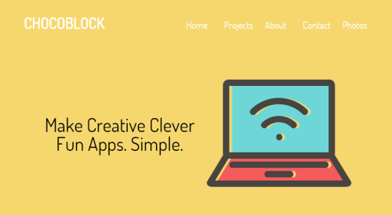
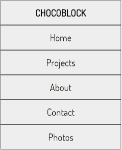
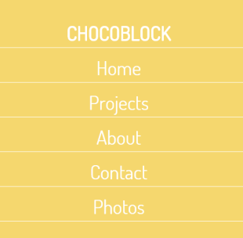
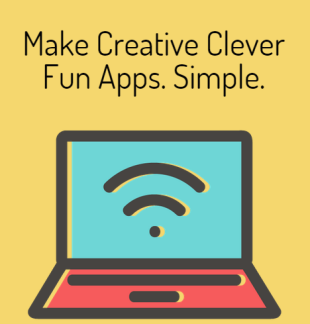
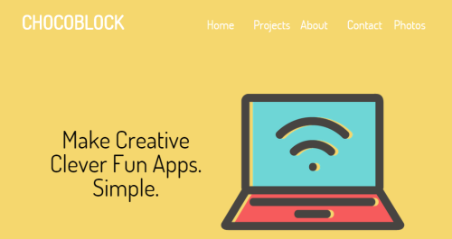

# Challenge

We are going to continue from our last Challenge and create a mobile first landing page. We will use some of this lesson’s topics as they come up.


The Prize


Open up the responsive navigation challenge from the last lesson:



First, let’s do a few design changes (you can change the styling to whatever you wish, but best wait until you are finished coding):

- Remove the grey background-color from the `<nav>`
- Give the `<body>` a background color of #F5D76E
- Change the colour of the text and border to white (#fff)
- Adjust the font size until you are satisfied
- Change the border on `<a>` for border-bottom only



**RESET.CSS**

First we are going to include a reset.css file. This will alter some of the default fonts and margins, just resize them after to your preference.

- Download the reset.css file (in the lesson folder) and include it in the head of the document.
- 
```
<link rel="stylesheet" type="text/css" href="reset.css">
```


**THE HTML**


mobile


desktop

We are going to add a message/tagline and an image after the nav. In the desktop version we will align them side-by-side, so we should take that into account. Flexbox will work well here. Let’s call this section landing. Inside a landing `<section>` we will have two divs:

- landing `<section>`
    - landing-message `<div>`
    - landing-graphic `<div>`
- The landing message can be a `<h2>` and you can find an image in the lesson folder.
- In this case, the landing div will be the flexbox container. The landing-message and landing-image are the flex-items.
- Style the font as you wish – the Dosis font-family was used in the example.
- Position the flex-items using justify-content and align-items.


**MEDIA QUERY**

- The desktop version should have the landing-message and landing-image side-by-side.  Use Flexbox for this.
- You may want to adjust the landing div. Use margins to center and give it space where it needs.
