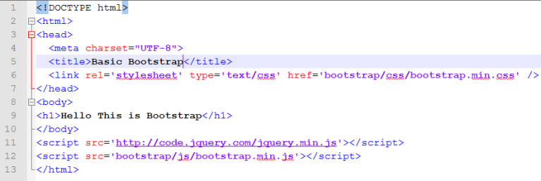

# Challenge

Creating Your First Web Page with Bootstrap:

Let’s walk through our very first page design using Bootstrap. At the end of this tutorial, you will have made a HTML file that displays the “Hello world” message in your web browser.

- Open up Sublime (code text editor we have previously downloaded).
- Begin by entering the following code and save it as “boot.html“.
bootstrapchallenge

The only notable difference from the above example that you may see is in the styling of the text. In the above code, you have added the bootstrap CSS in the header (css/bootstrap.min.css) and two scripts at the end of the body tag (highlighted above). Now you are ready to use bootstrap – and this is just the beginning!

 
The contents of the `<script>` tags shown in the above example will not be used for a few more lessons. However, they are part of the Bootstrap Setup, and therefore need to be included at this point.
`<script>` tags link to javascript files and are often added inside the `<head>` tags, just like .css files. However, there is an advantage to adding them to the bottom of the document. The more scripts you add to the page increases the page loading time. Placing scripts in the header means the content won’t be displayed until all the scripts have loaded. By adding the scripts to the bottom of the document, the HTML can be displayed first and the scripts can load afterwards. As a result, the user is not left waiting.