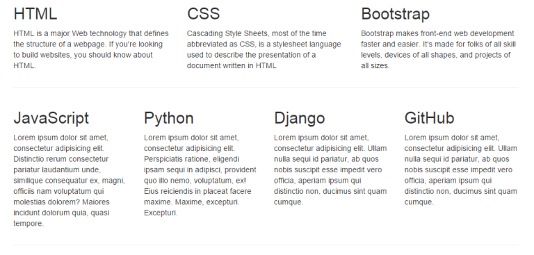
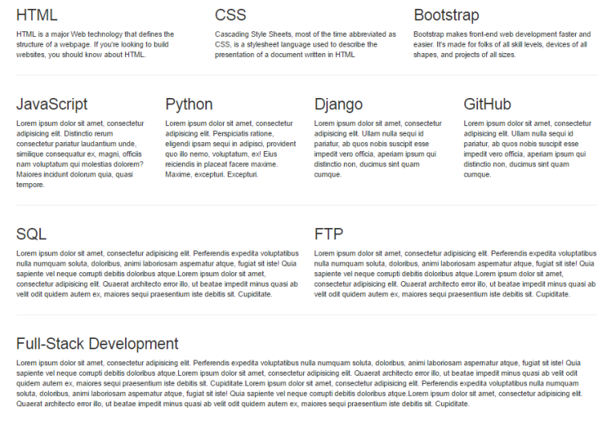

# Challenge

**Part A:**

Let’s continue from the last challenge and create a row with a 3-column layout. Each column will contain a heading (`<h2>`) and a paragraph (`
`), similar to the graphic shown below:

 
When you are making mockup sites, you don’t want to be typing random content just to fill a paragraph tag. Lorem ipsum… is a standard text for adding as a placeholder before the content is ready. Sublime has a shortcut for using this. In Sublime, simply type lorem and press the tab key. Instant Lorem ipsum text should appear, similar to that shown below:

“Lorem ipsum dolor sit amet, consectetur adipiscing elit, sed do eiusmod tempor incididunt ut labore et dolore magna aliqua. Ut enim ad minim veniam, quis nostrud exercitation ullamco laboris nisi ut aliquip ex ea commodo consequat. Duis aute irure dolor in reprehenderit in voluptate velit esse cillum dolore eu fugiat nulla pariatur. Excepteur sint occaecat cupidatat non proident, sunt in culpa qui officia deserunt mollit anim id est laborum.”

**Part B:**

Following on from Part A and underneath the 3-column layout, add another row with a 4-column layout. Use the horizontal rule `
` tag to separate the rows, as shown below:

**Part C:**

Continue the challenge by adding a row with a 2-column layout, and another with a 1-column layout, underneath the previous parts as shown below:

This challenge has shown you how you can use Bootstrap to build row upon row of content. This creates the page layout in terms of rows and columns and demonstrates the Grid System at work. The building of layouts in this manner is very powerful for rapidly designing page layouts.

This is the most important concept to grasp when using Bootstrap. If you are still unsure about how Grids function, go back to the challenge and experiment with more layouts until you are comfortable with the process.