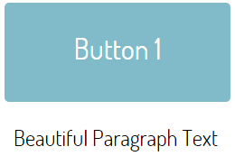
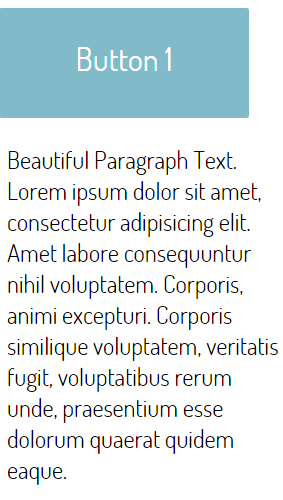
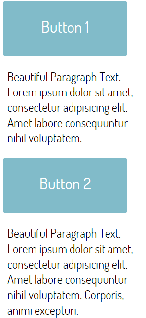
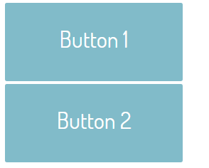

# Challenge

**Challenge A:**

Download **Sample-Site.zip** from the lesson folder. Unzip and bring up the folder in Sublime. Make changes to the **script.js** file for the jQuery code.

**Part 1:** Apply the following behaviour to the blue button in the button.html file:

- Create a CSS class (**makeRed**, add it to **style.css**) which gives the Button a red color, apply this class to the button Element (add to class attribute in the html).
- Create another class (**makeBorder**, add it to **style.css**) which gives the Button a border of 2px, do not apply to the HTML.
- On **mouseenter** remove the **red** class and add the **border** class.
- On **mouseleave** reverse the above.
- Use **method chaining** to achieve the above.

**Part 2:**

- When the button is clicked, make the paragraph slide up. When clicked again, make it slide down.

This is a real world example of how jQuery can be used on a button or on a menu item.

**Part 3:**

- Now try **hide()** / **show()** and **fadeIn()** / **fadeOut()** on button click.
- Create a second button and paragraph.
- Run the code and click on the buttons.

You will notice that both buttons perform the same action on both paragraphs. Even if you mouse over one button, both are highlighted (if you still have the mouseover code).

Why?

Because for now, our jQuery code says so.

Challenge B:

- Go to eir.ie
- Using Developer tools to change all the links (hrefs) so they point to www.codeinstitute.net.

